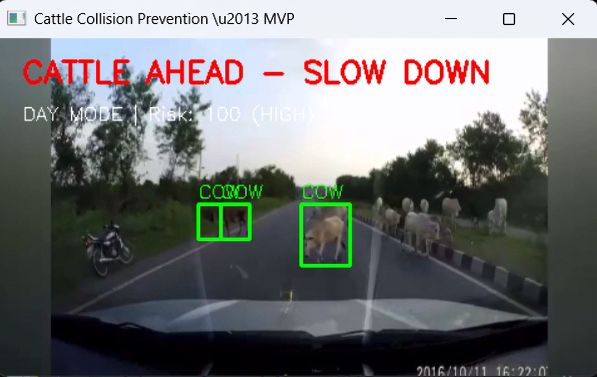

# 🐄 Smart Cattle Collision Prevention System

A real-time computer vision system designed to detect cattle on roads and predict potential collision risks using AI and OpenCV.

---

## 📌 Problem
Cattle-related road accidents are a major safety issue, especially in rural and semi-urban areas. Manual monitoring is not scalable.

---

## 🎯 Objective
To build a real-time detection system that identifies cattle and estimates collision risk for early warnings.

---

## ⚙️ System Pipeline
1. Capture video frames  
2. Detect cattle using computer vision  
3. Track object position across frames  
4. Estimate collision risk based on proximity and movement  

---

## 🧠 Key Features
- Real-time cattle detection  
- Collision risk estimation  
- Lightweight and efficient pipeline  

---

## 🛠️ Tech Stack
- Python
- YOLO
- OpenCV
- Deep Learning  

---

## 🎥 Demo

[](videos/demo.mp4)

---

## 📊 Output Examples


---

## 🤝 Contribution
This project was developed collaboratively.  

My contributions include:
- Implementing parts of the detection pipeline  
- Working on preprocessing and testing  
- Improving system performance and evaluation  

---

## 🚀 Future Improvements
- Add distance estimation  
- Deploy as a real-time alert system  

---

## ▶️ How to Run
```bash
pip install -r requirements.txt
python main.py
